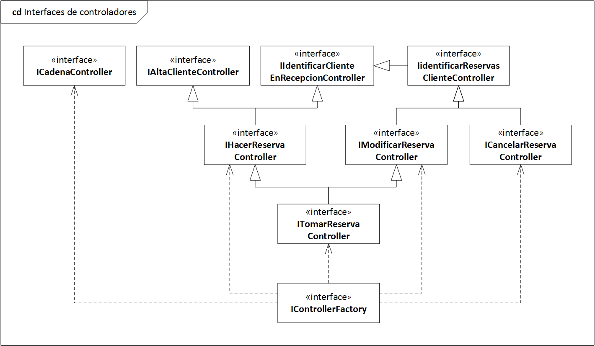
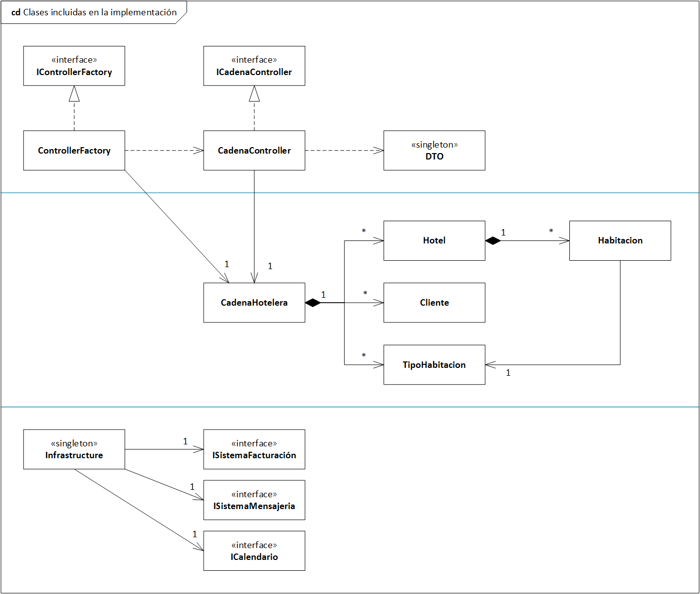

# TDS 2022

## Entorno de desarrollo

* JDK 1.8: [https://www.oracle.com/java/technologies/javase/javase-jdk8-downloads.html](https://www.oracle.com/java/technologies/javase/javase-jdk8-downloads.html)

* Eclipse IDE for Java Developers: [https://www.eclipse.org/downloads/packages/](https://www.eclipse.org/downloads/packages/)

## Interfaces de controladores

## Clases incluidas en la implementación

## Implementación base

* [tds.zip](./tds.zip)
